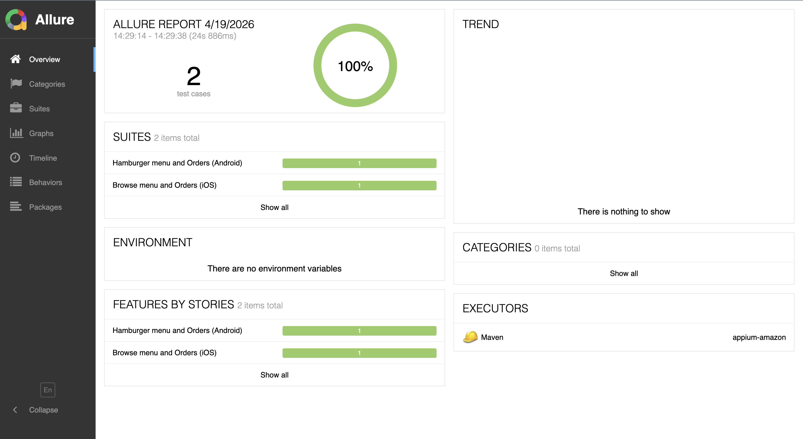

# appium-amazon

## Setup

**`src/main/resources/local.properties`** . Placeholder example:

```properties
IOS_UDID=00000000-000A0000EXAMPLE0001
IOS_XCODE_ORG_ID=ABCDE12345
IOS_UPDATED_WDA_BUNDLE_ID=com.example.WebDriverAgentRunner
IOS_PLATFORM_VERSION=18.0
APPIUM_SERVER_URL=http://127.0.0.1:4723/
IOS_XCODE_SIGNING_ID=Apple Development

ANDROID_UDID=emulator-5554
```

iOS session reads **only** this file for those keys (no env / `-D` overrides in code).

## Run

```bash
mvn clean test
```

## Reports

```bash
mvn clean test allure:report
allure serve target/allure-results
```

### Allure overview



### iOS summary


### iOS detail


### Android summary


### Android detail

